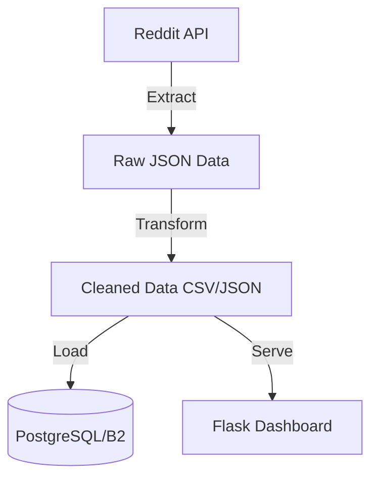

# Reddit ETL Pipeline


A scalable ETL pipeline for extracting Reddit data, transforming it, and loading it for analytics.

## 📌 Overview

This repository currently provides a baseline ETL flow:
1. Extract posts/comments from Reddit API.
2. Transform and clean raw payloads.
3. Load cleaned data to storage/database targets.
4. Visualize core KPIs in a dashboard.

## 🛠️ Current Architecture



## 📊 Dashboard

Dashboard path: `src/dashboard/app.py`

Main metrics:
- Total posts/comments
- Average post score
- Comment per post ratio
- Active subreddits and top subreddit
- Daily trend of posts and comments
- Top subreddits by post volume
- Top posts by score

Run dashboard locally:

```bash
cd Reddit-ETL-Pipeline
pip install -r requirements.txt
python src/main.py
python src/dashboard/app.py
```

Then open: `http://localhost:8501`

> Note: ETL (`python src/main.py`) generates `data/processed/posts.csv` and `data/processed/comments.csv`, which the dashboard reads.

## 🚀 Upgrade Plan (Data Engineer Portfolio + Dashboard)

Detailed roadmap: `docs/PROJECT_UPGRADE_PLAN.md`

## ▶️ Run ETL

```bash
pip install -r requirements.txt
python src/main.py
```
