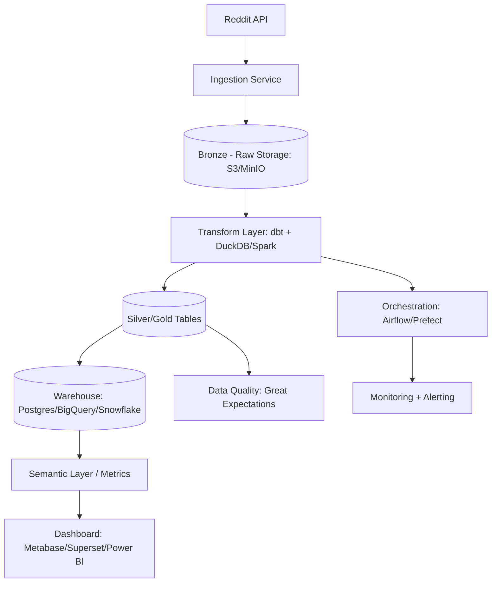

# Kế hoạch nâng cấp Reddit-ETL-Pipeline thành dự án Data Engineer hoàn chỉnh (có Dashboard)

## 1) Mục tiêu sản phẩm

Xây repo hiện tại thành một **data platform mini end-to-end**:
- Thu thập dữ liệu Reddit theo lịch (subreddit, keyword, timeframe).
- Lưu dữ liệu theo mô hình Lakehouse (raw/silver/gold) và data warehouse để phân tích.
- Chuẩn hoá chất lượng dữ liệu (tests, checks, lineage, docs).
- Cung cấp dashboard theo thời gian thực gần đúng (near real-time) cho business/user.

## 2) Kiến trúc đề xuất

## 3) Lộ trình triển khai theo phase

### Phase 1 — Foundation (1-2 tuần)
1. **Chuẩn hoá cấu trúc repo** theo domain:
   - `ingestion/`, `transform/`, `warehouse/`, `orchestration/`, `dashboard/`, `infra/`, `tests/`.
2. **Docker hoá toàn bộ stack**:
   - API worker + scheduler + warehouse + BI tool.
3. **Environment management**:
   - `.env.example`, cấu hình theo `dev/staging/prod`.
4. **Logging chuẩn JSON + trace_id** để debug pipeline.

### Phase 2 — Reliable ETL/ELT (2-3 tuần)
1. Chuyển từ script ETL đơn lẻ sang **ELT + incremental load**.
2. Tạo bảng chuẩn:
   - `dim_subreddit`, `dim_author`, `fact_post`, `fact_comment`, `fact_engagement_daily`.
3. Thiết lập **partitioning + indexes** (theo ngày, subreddit).
4. Áp dụng **idempotency** (chạy lại không nhân bản dữ liệu).

### Phase 3 — Data Quality + Governance (1-2 tuần)
1. Viết tests dữ liệu:
   - uniqueness, not null, accepted values, freshness.
2. Data contracts cho schema API Reddit.
3. Data dictionary + lineage + owner cho từng bảng.
4. Cảnh báo Slack/Email khi pipeline fail hoặc freshness trễ.

### Phase 4 — Dashboard & Analytics (1-2 tuần)
1. Build semantic metrics:
   - số bài viết/ngày, comment/post ratio, upvote velocity, top subreddit.
2. Dashboard gồm 3 lớp:
   - **Executive**: tổng quan volume & trend.
   - **Product/Community**: engagement theo subreddit/topic.
   - **Ops**: data freshness, job success rate, latency.
3. Thiết lập refresh policy:
   - 15 phút/1 giờ tuỳ nhu cầu.

### Phase 5 — CI/CD + Production readiness (1 tuần)
1. CI: lint + unit test + data test + build image.
2. CD: deploy tự động lên staging/prod.
3. Backup + disaster recovery cho warehouse.
4. Runbook sự cố + SLA/SLO.

## 4) Thiết kế mô hình dữ liệu dashboard (gợi ý)

### Fact tables
- `fact_post`
  - `post_id`, `subreddit_id`, `author_id`, `created_at`, `score`, `num_comments`, `title_length`, `sentiment_score`.
- `fact_comment`
  - `comment_id`, `post_id`, `author_id`, `created_at`, `score`, `sentiment_score`.
- `fact_engagement_daily`
  - `date`, `subreddit_id`, `post_count`, `comment_count`, `avg_score`, `engagement_rate`.

### Dimension tables
- `dim_subreddit`: thông tin subreddit, category, nsfw flag.
- `dim_author`: author attributes (ẩn danh hoá nếu cần).
- `dim_time`: day/week/month/quarter.

## 5) Bộ KPI nên có trên dashboard

1. Total posts/comments theo ngày, tuần, tháng.
2. Engagement rate = `(comments + score) / posts`.
3. Top trending topics (N-gram hoặc topic model).
4. Sentiment trend theo subreddit.
5. Retention tác giả: số user quay lại theo cohort tuần.
6. Freshness: độ trễ dữ liệu từ Reddit -> dashboard.

## 6) Công nghệ đề xuất (pragmatic)

### Option A (nhanh, dễ demo)
- Ingestion: Python + PRAW
- Storage/Lake: MinIO + Parquet
- Transform: dbt-duckdb
- Orchestrator: Prefect
- Dashboard: Metabase

### Option B (production-ready hơn)
- Ingestion: Python + Kafka (tuỳ volume)
- Storage: S3 + Delta/Iceberg
- Transform: dbt + Spark
- Orchestrator: Airflow
- Warehouse: BigQuery/Snowflake
- Dashboard: Superset/Power BI

## 7) Checklist “project data engineer hoàn chỉnh”

- [ ] Có kiến trúc nhiều môi trường dev/staging/prod.
- [ ] Pipeline có retry, backfill, idempotent.
- [ ] Data quality checks chạy tự động trong DAG.
- [ ] Có metadata/lineage/documentation.
- [ ] Dashboard phân tầng cho business + technical.
- [ ] CI/CD và monitoring đầy đủ.
- [ ] Có chi phí vận hành (cost observability) và tối ưu truy vấn.

## 8) Ưu tiên thực thi ngay trong repo này (quick wins)

1. Chuẩn hoá README + architecture diagram hoàn chỉnh.
2. Thêm `docker-compose.yml` để chạy local stack (postgres + airflow/prefect + metabase).
3. Tạo thư mục `models/` cho dbt + 5 model cốt lõi.
4. Thêm `tests/` cho transform logic hiện tại.
5. Tạo dashboard mẫu (Metabase) với 1-2 câu hỏi chính.

---

Nếu thực hiện theo lộ trình trên, repo sẽ đi từ ETL script-level sang một **Data Engineering Project Portfolio** đúng chuẩn tuyển dụng: có kiến trúc, chất lượng dữ liệu, orchestration, observability và dashboard phục vụ quyết định.
